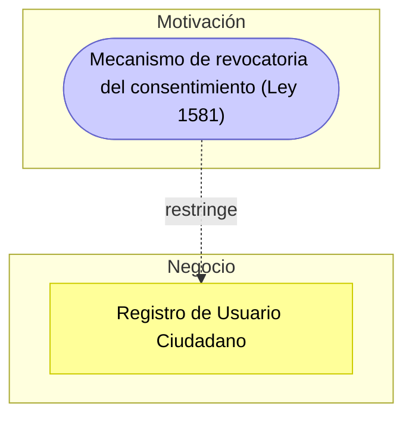

# Guía Paso a Paso: Checklist de Cumplimiento Normativo

Esta guía complementa el `README.md` del taller. Su objetivo es que, antes de evaluar el cumplimiento normativo de GobData en clase (Parte 1) o del sistema del cliente real (Parte 2), el equipo tenga una referencia clara de qué exige cada marco y de la metodología para pasar de "marcar casillas" a un diagnóstico legal priorizado.

---

## 1. Marcos normativos de referencia

| Marco / Norma | Qué exige (resumen) | Aplica cuando... |
|---|---|---|
| Habeas Data (Ley 1581 de 2012 - Colombia) | Consentimiento informado, finalidad del tratamiento, derechos ARCO (Acceso, Rectificación, Cancelación, Oposición) | El sistema recolecta datos personales de ciudadanos o usuarios colombianos |
| ISO/IEC 27001 | Gestión sistemática de la seguridad de la información: control de accesos, gestión de incidentes, continuidad | El sistema maneja información que debe protegerse de forma sistemática |
| Protección contra fugas de datos | Cifrado, monitoreo y respuesta ante incidentes de exposición de datos | El sistema almacena o transmite datos sensibles |
| Consentimiento, auditoría y roles de acceso | Registro de quién accede a qué dato, bajo qué autorización | El sistema tiene múltiples roles con distinto nivel de acceso a datos sensibles |

---

## 2. Metodología en 5 pasos

1. **Identificar datos y procesos sensibles** — liste qué información procesa el sistema y qué normativa le aplica a cada una.
2. **Construir el checklist** — agrupe los requisitos a verificar por categoría (consentimiento, seguridad, protección de datos, prevención de fugas, retención), basándose en los marcos de la sección 1.
3. **Evaluar el cumplimiento** — para cada ítem, marque **Cumple** o **Parcial** — la plantilla oficial solo tiene estos dos estados por ítem, siempre con evidencia o justificación concreta.
4. **Documentar el riesgo de cada brecha** — "Brecha" no es un tercer estado del checklist: cada ítem marcado Parcial (o cualquier incumplimiento real detectado) se documenta como una fila aparte en la hoja **Brechas Identificadas**, explicando qué pasa si no se corrige (sanción, exposición de datos, pérdida de trazabilidad) y con qué nivel de riesgo.
5. **Priorizar y recomendar** — ordene las brechas por riesgo y proponga una acción correctiva concreta para cada una.

---

## 3. Ejemplo guiado: Checklist de GobData

### Paso 1 — Identificar datos y procesos sensibles

| Dato / Proceso | Sensibilidad | Normativa aplicable |
|---|---|---|
| Número de identificación (cédula) | Dato personal | Ley 1581 |
| Historial clínico | Dato sensible (salud) | Ley 1581 (tratamiento reforzado) |
| Dirección de residencia | Dato personal | Ley 1581 |
| Certificados digitales | Dato de identidad / autenticación | ISO 27001 (control de accesos) |
| Trámites y peticiones ciudadanas | Trazabilidad de gestión pública | ISO 27001 (auditoría) |

### Paso 2 — Construir el checklist por categoría

| Categoría | Ítem (ejemplo) |
|---|---|
| Consentimiento | Consentimiento informado al ciudadano y mecanismo para revocarlo |
| Seguridad (ISO 27001) | Política formal de seguridad, cifrado en tránsito/reposo, plan de continuidad |
| Protección de Datos | Oficial de Protección de Datos (DPO), logs de acceso a información personal |
| Prevención de Fugas | Control de exportaciones manuales (DLP) |
| Retención | Política de retención y anonimización de datos sensibles |
| Roles y Responsabilidades | Roles y permisos documentados, formación del personal en protección de datos |

### Paso 3 — Evaluar el cumplimiento

La plantilla oficial solo tiene **dos** estados posibles por ítem: **Cumple** y **Parcial** — no hay un tercer estado. Marque Parcial cuando un control está implementado de forma incompleta (por ejemplo, aplicado solo a una parte del sistema o solo por un canal manual), siempre con evidencia o justificación concreta. Esta es la evaluación completa de los 12 ítems de GobData, tal como quedó en la hoja **Checklist General**:

| N° | Categoría | Criterio de Cumplimiento | Nivel de Cumplimiento | Evidencia / Justificación | Recomendación |
|---|---|---|---|---|---|
| 1 | Consentimiento | Se solicita consentimiento informado al ciudadano antes del tratamiento de datos. | Cumple | Casilla de aceptación de términos en el registro de usuario. | Detallar fines específicos del tratamiento. |
| 2 | Consentimiento | Mecanismo para revocar el consentimiento disponible. | Parcial | Solo mediante solicitud escrita. | Implementar botón o formulario en línea. |
| 3 | Seguridad (ISO 27001) | Existe política formal de seguridad. | Cumple | Política de TI estatal basada en ISO/IEC 27001:2013. | Mantenerla actualizada conforme a versión 2022. |
| 4 | Seguridad (ISO 27001) | Cifrado de datos en tránsito y reposo. | Cumple | HTTPS/TLS y cifrado de campos sensibles. | Revisar certificados y algoritmos anualmente. |
| 5 | Seguridad (ISO 27001) | Plan de continuidad y recuperación. | Parcial | Respaldos diarios sin plan BCP/DRP formal. | Diseñar e implementar plan de continuidad documentado. |
| 6 | Protección de Datos | Se cuenta con un Oficial de Protección de Datos (DPO). | Cumple | Funcionario asignado conforme a Ley 1581. | Reforzar su rol en auditorías y reportes. |
| 7 | Protección de Datos | Logs de acceso a información personal. | Cumple | Sistema registra y audita consultas. | Revisar integridad y retención de logs. |
| 8 | Prevención de Fugas | Se controlan exportaciones manuales. | Parcial | No hay controles DLP. | Implementar políticas y herramientas DLP. |
| 9 | Retención | Política formal de retención de datos. | Cumple | Cumple con Ley General de Archivos. | Automatizar procesos de eliminación. |
| 10 | Retención | Datos sensibles se anonimizarán cuando dejen de ser necesarios. | Parcial | No hay proceso implementado. | Desarrollar política de anonimización. |
| 11 | Roles y Responsabilidades | Roles y permisos documentados. | Cumple | Manual de seguridad define roles (dueño, custodio, usuario). | Actualizar trimestralmente. |
| 12 | Roles y Responsabilidades | Formación del personal en protección de datos. | Parcial | Capacitación anual sin evaluación. | Medir efectividad y reforzar entrenamiento. |

### Paso 4 — Documentar el riesgo de cada brecha

Cada uno de los 5 ítems marcados Parcial (#2, #5, #8, #10, #12) se convierte en una fila aparte de la hoja **Brechas Identificadas**, con su propia columna de Riesgo:

| Categoría | Brecha | Riesgo |
|---|---|---|
| Consentimiento | No existe mecanismo automático de revocatoria. | Medio |
| Seguridad | No hay plan formal de continuidad (BCP/DRP). | Alto |
| Prevención de Fugas | Exportación manual no controlada. | Alto |
| Retención | No existe eliminación automatizada. | Medio |
| Formación | Sin evaluación de efectividad. | Bajo |

### Paso 5 — Priorizar y recomendar

Esta es la tabla final que se entrega como `checklist-cliente.xlsx`, con la misma estructura de la hoja **Brechas Identificadas** de la plantilla oficial:

| Categoría | Brecha | Riesgo | Recomendación Prioritaria | Nivel de Prioridad |
|---|---|---|---|---|
| Consentimiento | No existe mecanismo automático de revocatoria. | Medio | Crear funcionalidad de eliminación y revocatoria digital. | Alta |
| Seguridad | No hay plan formal de continuidad (BCP/DRP). | Alto | Diseñar, probar e implementar plan de continuidad. | Alta |
| Prevención de Fugas | Exportación manual no controlada. | Alto | Implementar DLP para controlar descargas y exportaciones. | Alta |
| Retención | No existe eliminación automatizada. | Medio | Configurar reglas de caducidad en base de datos. | Media |
| Formación | Sin evaluación de efectividad. | Bajo | Aplicar pruebas posteriores a capacitación. | Media |

Vea esta misma tabla en su [versión visual e interactiva](visualizacion-normatividad.html), con la evidencia y el riesgo de cada ítem del checklist un clic más cerca.

---

## 4. Errores comunes a evitar

| Error frecuente | Por qué es un problema | Cómo corregirlo |
|---|---|---|
| Marcar "Cumple" sin evidencia concreta | El checklist se vuelve una opinión, no una auditoría verificable | Cite dónde se observa el cumplimiento (documento, pantalla, configuración) |
| Confundir "Parcial" con "Brecha" | "Brecha" no es un estado que se marca en el checklist: es la tabla derivada (Brechas Identificadas) que documenta el riesgo de cada incumplimiento real | Marque el ítem como Parcial en el Checklist General y registre la brecha correspondiente, con su riesgo, en la hoja Brechas Identificadas |
| Copiar el checklist genérico sin adaptarlo al sector del cliente | Ignora normativas sectoriales específicas (salud, educación, finanzas) | Investigue y agregue normativas propias del sector del cliente (MinSalud, MinTIC, SuperSalud, SFC, etc.) |
| Recomendaciones sin relación con la brecha encontrada | El informe pierde utilidad práctica para el cliente | Cada recomendación debe corregir directamente el ítem registrado en la hoja de Brechas Identificadas |

---

## 5. Checklist de autoevaluación antes de entregar

- [ ] Cada ítem está evaluado como Cumple o Parcial, con evidencia o justificación; cada Parcial (o incumplimiento real) queda registrado en la tabla de Brechas Identificadas.
- [ ] Los ítems están organizados por categoría (consentimiento, seguridad, protección de datos, prevención de fugas, retención, etc.).
- [ ] Cada brecha tiene un riesgo legal/operativo explicado, no solo "no cumple".
- [ ] Se investigaron normativas sectoriales adicionales aplicables al cliente.
- [ ] Las brechas están priorizadas y cada una tiene una recomendación correctiva concreta.
- [ ] El informe cita la normativa específica detrás de cada hallazgo, cuando aplica.

---

## 6. Vista ArchiMate equivalente

Igual que en el Taller 5, cada brecha del checklist se modela como un elemento de Motivación (ver la [Guía de Notación ArchiMate](https://github.com/CesarAVegaF312/AREM-ArchiMate/blob/main/guia_notacion_archimate.md)) — pero aquí normalmente es una **Constraint** (algo que la ley obliga, no una opción de diseño) en vez de un Requirement funcional.

La tabla de priorización (Paso 5) es, otra vez, el insumo directo: cada fila de la hoja Brechas Identificadas se convierte en una `Constraint` que restringe al proceso de negocio o al componente de aplicación donde ocurre — y que después, en el Taller 7, origina un `Gap` a cerrar en el TO-BE.

---

_Esta guía hace parte del Taller 6 de Checklist de Cumplimiento Normativo — curso Arquitectura Empresarial, Universidad de La Sabana._
