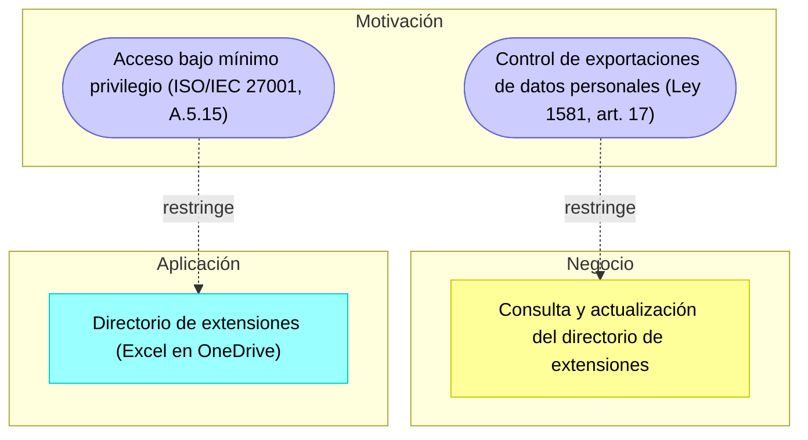

# Informe Técnico del Taller

## Nombre del Taller
_Taller 6 - Checklist de Cumplimiento Normativo_

## Integrantes del equipo
- Juan Pablo Luna Zuleta (juanluzu@unisabana.edu.co)
- Alejandro Riveros
- Martín Ortega

## Descripción general del trabajo

El objetivo del taller era verificar qué aspectos legales y normativos aplican al sistema del cliente y en cuáles hay incumplimientos reales que deban corregirse. En clase aplicamos la metodología de cinco pasos sobre el caso base de GobData y después la repetimos sobre el sistema de nuestro cliente: el directorio de extensiones telefónicas de la Jefatura de Cultura de Innovación y Servicio de la Universidad de La Sabana, un archivo de Excel en OneDrive con cerca de 6.400 registros que consultan cuatro agentes de servicio.

Aunque es un solo archivo y no una plataforma, contiene datos personales de funcionarios (nombre, cargo, unidad, correo institucional y extensión) y por eso queda cubierto por la Ley 1581 de 2012 y su decreto reglamentario. El resultado fue un checklist de 17 ítems agrupados en siete categorías, de los cuales 6 quedaron en Cumple y 11 en Parcial, y una tabla derivada de 11 brechas priorizadas.

## Proceso de desarrollo

Empezamos por el paso 1 de la metodología, identificando qué datos procesa el directorio y qué norma le aplica a cada uno. Esto fue más importante de lo que parecía, porque la primera reacción del equipo fue asumir que "son solo extensiones" y que por eso el taller no aplicaba. Al listar los campos quedó claro que sí hay datos personales de tipo público y semiprivado, que el tratamiento lo hace un tercero (Microsoft) como Encargado y que los titulares son los propios funcionarios de la Universidad, quienes conservan sus derechos de consulta, actualización y rectificación.

Para el paso 2 reutilizamos las categorías del caso base (consentimiento, seguridad, protección de datos, prevención de fugas, retención, roles) y agregamos dos propias del cliente: calidad del dato, porque el principio de calidad del artículo 4 de la Ley 1581 es justamente donde este sistema falla, y transmisión internacional, porque el archivo se encuentra alojado en la nube de Microsoft, que actúa como Encargado del Tratamiento por cuenta de la Universidad.

En el paso 3 evaluamos cada ítem con la evidencia que teníamos de las sesiones anteriores con Johanna Molina y del análisis del archivo hecho en los talleres previos. Fuimos estrictos con la regla de no marcar Cumple sin evidencia concreta: cuando el control existe pero solo por el lado institucional y no aterriza en el directorio, lo dejamos en Parcial. Los pasos 4 y 5 los hicimos en la hoja de Brechas Identificadas, documentando el riesgo legal u operativo de cada incumplimiento y ordenándolos por prioridad.

La herramienta fue Excel sobre la plantilla oficial del taller, respetando las dos hojas y las columnas originales. Solo agregamos formato condicional de color y validación de lista en la columna de nivel de cumplimiento, para que el cliente pueda seguir usando el archivo sin romper la estructura.

## Análisis del modelo propuesto

El checklist está estructurado en dos niveles. El primero, la hoja Checklist General, es la fotografía del estado actual: 17 criterios verificables, cada uno con su evidencia y una recomendación de mejora, incluso para los que ya cumplen. El segundo, la hoja Brechas Identificadas, es la tabla derivada: una fila por cada ítem marcado Parcial, con el riesgo que implica dejarlo así y la acción correctiva concreta. Esa separación es la que evita el error de tratar "brecha" como un tercer estado del checklist.

Sobre cómo representa las necesidades del cliente, el hallazgo central del diagnóstico coincide con lo que ya habíamos visto en el modelado STRIDE del Taller 5: el riesgo dominante no es un atacante externo sino la degradación interna del dato por edición manual. Las tres brechas de riesgo Alto (exportaciones sin control, permisos de edición amplios para los cuatro agentes y ausencia de llave única para conciliar) describen el mismo problema desde ángulos distintos, y las tres se corrigen con configuración del tenant que ya está pagada, sin instalar nada externo. Eso importa porque la restricción dura del cliente es precisamente esa: cualquier software externo pasa a revisión de comité, y ya existe el antecedente de un desarrollo previo que nunca llegó a producción.

Los supuestos que tomamos fueron tres. Primero, que los controles institucionales de seguridad (política, MFA, cifrado) aplican al tenant completo y por lo tanto también al archivo, aunque nadie los haya verificado específicamente sobre él. Segundo, que la Universidad, como entidad sin ánimo de lucro con activos por encima de las 100.000 UVT, sí está dentro del ámbito del Registro Nacional de Bases de Datos, por lo que la pregunta relevante no es si debe registrar sino si este directorio quedó reflejado en ese registro; esto debe confirmarlo la Dirección Jurídica. Tercero, que la relación laboral y la política institucional publicada son base suficiente para el tratamiento, de modo que la brecha de consentimiento no es la autorización en sí sino el deber de información y el canal para ejercer derechos.

## Diagrama final entregado

> Checklist diligenciado: [`entrega/checklist-cliente.xlsx`](checklist-cliente.xlsx) — hojas `Checklist General` (17 ítems) y `Brechas Identificadas` (11 brechas priorizadas).

Siguiendo la sección 6 de la guía, cada brecha se modela en ArchiMate como una Constraint de la capa de Motivación, no como un Requirement, porque es la ley la que obliga. La representación equivalente de las dos brechas de mayor prioridad sería:

## Tabla de actores, entidades o componentes

| Nombre del elemento | Tipo | Descripción | Responsable |
|---|---|---|---|
| Jefatura de Cultura de Innovación y Servicio | Actor / Responsable del Tratamiento | Dueña funcional del directorio; define finalidad y uso | Cliente |
| Agentes de servicio (4) | Actor / Usuarios | Consultan y editan el directorio para atender llamadas | Cliente |
| Funcionarios de la Universidad | Titulares del dato | Personas cuyos datos aparecen en el directorio | — |
| Microsoft 365 (OneDrive / SharePoint) | Encargado del Tratamiento | Almacena y procesa el archivo por cuenta de la Universidad | Proveedor |
| Directorio de extensiones (.xlsx) | Entidad de datos | ~6.400 registros con nombre, cargo, unidad, correo y extensión | Cliente |
| Archivo de nómina | Entidad de datos | Fuente de las novedades de personal; única que contiene el Id Empleado | Cliente |
| Dirección Jurídica | Actor de apoyo | Verifica inventario de bases de datos y RNBD | Cliente |

## Investigación complementaria

### Tema investigado:
Normativa colombiana de protección de datos aplicable a una institución de educación superior privada y condiciones para el tratamiento en servicios de nube.

### Resumen:

El marco base es la Ley Estatutaria 1581 de 2012, reglamentada por el Decreto 1377 de 2013 y compilada hoy en el Decreto Único 1074 de 2015. De ahí salen los deberes que evaluamos en el checklist: informar la finalidad al titular, atender consultas en diez días hábiles y reclamos en quince, garantizar la calidad del dato y conservarlo solo mientras sea necesario. El artículo 4 fija el principio de calidad, que es el que sustenta que hayamos tratado la exactitud del directorio como un asunto normativo y no solo operativo.

Sobre el registro de bases de datos, el capítulo 26 del Decreto 1074 de 2015 fue modificado por el Decreto 090 de 2018, que redujo el universo de obligados: siguen obligadas a registrar sus bases de datos las entidades sin ánimo de lucro con activos totales superiores a 100.000 UVT y las entidades de naturaleza pública. Una universidad privada del tamaño de La Sabana queda dentro de ese umbral, así que la pregunta para el cliente no es si registra, sino si este directorio en particular quedó cubierto por el registro existente.

En cuanto al uso de servicios en la nube, el caso corresponde principalmente a una transmisión internacional de datos, ya que Microsoft actúa como Encargado del Tratamiento y procesa la información por cuenta de la Universidad, que conserva la calidad de Responsable. De acuerdo con el Decreto 1074 de 2015 y las instrucciones de la SIC, las transmisiones internacionales deben contar con las garantías correspondientes, entre ellas un contrato de transmisión de datos que establezca el alcance del tratamiento, las actividades que realizará el Encargado y sus obligaciones frente al Responsable y los titulares.

Por lo tanto, para este directorio debe verificarse que la relación contractual de la Universidad con Microsoft contemple las condiciones aplicables a la transmisión internacional de datos personales. Esto complementa las recomendaciones de auditoría, clasificación de la información y prevención de fugas planteadas en el checklist.

## Referencias

Ver [`referencias.md`](referencias.md).

---

_Este documento hace parte de la entrega del Taller 6 del curso AREM (Arquitectura Empresarial) - Universidad de La Sabana._
